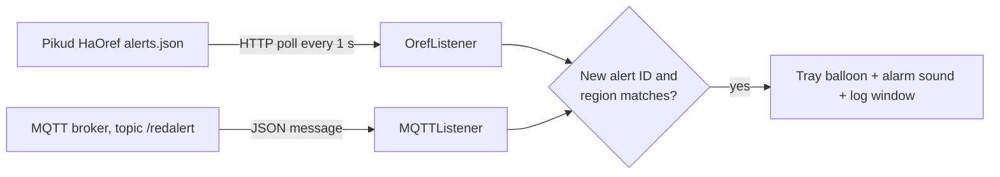

# RedAlertop

RedAlertop is a small, lightweight Windows tray application written in C# (.NET Framework WinForms)
that shows Israeli Red Alert (Tzeva Adom) rocket alerts on your desktop. It runs in the background,
polls the Pikud HaOref (Home Front Command) alert feed or listens on an MQTT broker, and pops up a
tray notification and plays an alarm sound when an alert is issued for your region.

> [!WARNING]
> **Safety disclaimer.** RedAlertop is an **unofficial** hobby project. It is **not affiliated with,
> endorsed by, or connected to Pikud HaOref (the Home Front Command)** or any government body.
> Alerts can be delayed, missed, or wrong: the feed can be unreachable, your PC can be asleep or
> offline, and the app can crash. **Do not rely on it for life safety.** Always use the official
> Home Front Command app, the official alert channels, and the public sirens, and follow the Home
> Front Command's instructions.

## Table of contents

- [Features](#features)
- [Screenshots](#screenshots)
- [How it works](#how-it-works)
- [Requirements](#requirements)
- [Installation](#installation)
- [Configuration](#configuration)
- [Usage](#usage)
- [Troubleshooting](#troubleshooting)
- [Known issues and limitations](#known-issues-and-limitations)
- [Security notes](#security-notes)
- [Development](#development)
- [Contributing](#contributing)
- [License](#license)

## Features

- Runs in the system tray, starts minimized and hidden, and uses few resources.
- Two alert sources:
  - **HTTP** (default): polls the Pikud HaOref alert feed once per second.
  - **MQTT**: subscribes to the `/redalert` topic on an MQTT broker you provide.
- Region filtering: `*` (the default) shows every alert; otherwise only alerts for your areas are shown.
- Tray balloon notification with the time, the alert title and the list of alerted areas.
- Plays an alarm sound. The bundled `alarmSound.wav` is the default; you can pick any `.wav` file.
- An in-app log window that lists every alert received while the app is running.
- Optional start with Windows (a shortcut in your Startup folder).
- Duplicate protection: an alert ID that was already shown is skipped (overlapping polls can still
  let a duplicate through).
- Single instance: a second copy of the app exits immediately.

## Screenshots

### Main window

[](https://github.com/t0mer/RedAlertop/blob/main/screeshots/redalertop.png?raw=true "RedAlertop")

### Tray icon

[](https://github.com/t0mer/RedAlertop/blob/main/screeshots/redalertop%20icon.png?raw=true "RedAlertop tray icon")

<!-- TODO: screenshot of an alert balloon notification -->

## How it works



The source is chosen at startup by the `AlertSource` setting (`http` or `mqtt`).

### HTTP mode (default)

`Helpers/OrefListener.cs` requests
`https://www.oref.org.il/WarningMessages/alert/alerts.json` every **1 second** (TLS 1.2) with these
headers:

| Header | Value |
|---|---|
| `Referer` | `https://www.oref.org.il/` |
| `User-Agent` | A desktop Chrome 78 on Windows 10 user agent string |
| `X-Requested-With` | `XMLHttpRequest` |

An empty response means there is no active alert. A non-empty response is parsed as JSON with the
fields `id`, `title` and `data` (the list of alerted areas). If the request fails, the error is
written to `Redalert.log` in the application folder and that request's handler sleeps 3 seconds.
The 1-second timer keeps firing in the meantime, so polls can overlap.

### MQTT mode

`Helpers/MQTTListener.cs` connects to the broker in `MQTTBroker` with the `MQTTUser` / `MQTTPass`
credentials and a random client ID, and subscribes to the topic **`/redalert`** with QoS 1. Every
message must be a JSON object in the same format as the Oref feed (example values):

```json
{ "id": 132456789, "title": "ירי רקטות וטילים", "data": ["שדרות", "ניר עם"] }
```

If the connection closes, the app retries to connect once per second. On exit it publishes
`Disconnected` to `/redalert/LWT` and unsubscribes.

> [!NOTE]
> The [Redalert](https://github.com/t0mer/Redalert) project also publishes to `/redalert`, but with
> plain-text payloads (`on`, `No active alerts`), not JSON. RedAlertop crashes on any non-JSON
> message on `/redalert`, so **pointing it at a broker where Redalert publishes will make it exit**.
> You need a publisher that sends the Oref JSON object to `/redalert`.
> <!-- TODO: verify which publisher this MQTT mode was designed for -->

### Alert handling

For both sources, an alert is shown only when:

1. its `id` has not been shown before during this run (overlapping HTTP polls can occasionally let
   a duplicate through), and
2. the region filter matches (see [Region filtering](#region-filtering)).

The notification is a tray balloon titled **Red Alert** (warning icon, requested 3-second timeout that Windows may ignore) that contains the
local time the alert was received (`dd/MM/yyyy HH:mm`), the alert title and each alerted area on its
own line. At the same time the sound file plays once, and a line with the time, title and areas is
added to the log window.

## Requirements

- Windows 10 or Windows Server 2016 or later (the targets listed in the InstallForge `.ifp`
  installer project).
- .NET Framework **4.5** or later (the project targets v4.5).
- For HTTP mode: internet access to `www.oref.org.il`. The Oref site may block requests from
  outside Israel. <!-- TODO: verify -->
- For MQTT mode: an MQTT broker that publishes Oref-format JSON to `/redalert`.

## Installation

### Installer from GitHub Releases

Download the setup from the [Releases page](https://github.com/t0mer/RedAlertop/releases). The only
release is **RedAlertop 1.0.0** (May 2021, asset `RedAlertop.Setup.zip`). It was published
**before MQTT support was added** (September 2021), so it supports HTTP mode only.

### Installer committed to the repository

A newer build of the setup is committed at
[`Installer/Output/RedAlertop.exe`](Installer/Output/RedAlertop.exe) (September 2021).

> [!CAUTION]
> Both setup files are **not code-signed**, so Windows SmartScreen will warn about an unknown
> publisher. Only run them if you trust the source, or build the app yourself from source.

### What the installer does

The installer is built with [Inno Setup](https://jrsoftware.org/isinfo.php) from
[`Installer/Setup.iss`](Installer/Setup.iss):

- Installs to `{autopf}\RedAlertop`. The installer runs in 32-bit mode, so on 64-bit Windows this is
  `C:\Program Files (x86)\RedAlertop`. It needs administrator rights.
- Copies `RedAlrtop.exe`, `RedAlrtop.exe.config`, `alarmSound.wav`, `RedAlert.ico`,
  `Newtonsoft.Json.dll`, `Interop.IWshRuntimeLibrary.dll` and `Interop.Shell32.dll`.
- Creates a Start menu shortcut, plus an optional desktop shortcut (unchecked by default).
- Offers to launch RedAlertop when setup finishes. Use this option: the first launch writes the
  config file in the installation folder, so it must run elevated (see [Troubleshooting](#troubleshooting)).
- Registers a standard uninstaller in *Apps & features*.
- Does **not** add a startup entry. Use the *Start RedAlertop at windows startup* option in the app.

The `Installer/*.ifp` files are an older InstallForge project for the same app. Release 1.0.0 was
very likely built with InstallForge, and `Setup.iss` came later.
<!-- TODO: verify whether the .ifp projects are still used -->

### Build from source

See [Development](#development).

## Configuration

Settings are `appSettings` keys in `App.config`, which is deployed as `RedAlrtop.exe.config` next to
the executable (for example `C:\Program Files (x86)\RedAlertop\RedAlrtop.exe.config`). The app reads them
at startup, so restart it after editing the file. `Properties/Settings.settings` is empty and not
used.

| Key | Default | Set from the UI | Description |
|---|---|---|---|
| `AlertSource` | `http` | No | `http` polls the Oref feed; `mqtt` uses the MQTT broker. Case-sensitive: anything other than exactly `mqtt` means HTTP. |
| `Region` | `*` | No (shown only) | `*` shows every alert. Otherwise the areas to watch; see [Region filtering](#region-filtering). Don't leave it empty: an empty value shows nothing at all. |
| `SoundFile` | *(empty)* | Yes | Full path of the `.wav` file to play. When empty, the app sets it to `alarmSound.wav` in the application folder and saves it on first run. |
| `MQTTBroker` | *(empty)* | No | MQTT broker host name or IP address (MQTT mode only). |
| `MQTTUser` | *(empty)* | No | MQTT user name (MQTT mode only). |
| `MQTTPass` | *(empty)* | No | MQTT password (MQTT mode only). |
| `MQTTPort` | *(empty)* | No | Must be a number in MQTT mode, or the app fails to start the listener. The value is not used: the client always connects to the default port 1883. |

Example for MQTT mode:

```xml
<appSettings>
  <add key="Region" value="*"/>
  <add key="SoundFile" value=""/>
  <add key="MQTTBroker" value="192.168.1.10"/>
  <add key="MQTTUser" value="your-user"/>
  <add key="MQTTPass" value="your-password"/>
  <add key="MQTTPort" value="1883"/>
  <add key="AlertSource" value="mqtt"/>
</appSettings>
```

### Settings window

| Control | What it does |
|---|---|
| **Start RedAlertop at windows startup** | Adds or removes the startup shortcut when you click **Save**. |
| **Region** | Shows the configured `Region`. Changes typed here are **not saved**; edit the config file instead. |
| **Sound File** + **...** | Pick a `.wav` file. Saved to `SoundFile` when you click **Save**. |
| **Save** | Writes `SoundFile` to the config file and applies the startup option. |
| Log box | Lists alerts received since the app started. |

### Region filtering

With `Region` set to `*`, every alert is shown. Don't leave it empty: an empty `Region` shows
nothing at all. Otherwise each alerted area name from the alert's `data` list is used as a
case-insensitive regular expression and searched for inside your `Region` value. The alert is shown
if at least one alerted area name appears in it. This means:

- Each entry must be the **complete** area name, exactly as Pikud HaOref writes it in Hebrew. A
  partial name in `Region` never matches.
- You can watch several areas by listing their full names in one value, for example
  `שדרות, אשקלון - דרום`.
- A short alerted area name that happens to appear inside one of your longer entries also fires.
- Because the alerted name is the regex pattern, characters such as `(`, `)` and `.` are interpreted
  as regex. An unbalanced bracket throws an error (in MQTT mode this crashes the app).

Area names are listed on the [Pikud HaOref website](https://www.oref.org.il/12481-he/Pakar.aspx).

### Start with Windows

When the option is enabled and saved, the app creates `RedAlrtop.lnk` in your user Startup folder
(`%APPDATA%\Microsoft\Windows\Start Menu\Programs\Startup`). This is per user. Disabling it deletes
every shortcut in that folder that points to the RedAlertop executable.

## Usage

- RedAlertop starts minimized and hidden, shows a *Red Alert is running* balloon, and keeps an icon
  in the system tray (see [Screenshots](#screenshots)).
- Double-click the tray icon to open the main window, and double-click it again to hide it.
- The **Minimize** button minimizes the window to the taskbar.
- The **X** (close) button **exits RedAlertop**. It does not hide it to the tray, and no alerts are
  shown until you start it again.

## Troubleshooting

- **No alerts in HTTP mode.** Check `Redalert.log` in the application folder for request errors.
  In an installed copy under Program Files the log probably can't be written without administrator
  rights, so it may never appear. Make sure `www.oref.org.il` is reachable from your network.
- **No sound.** The sound must be a `.wav` file that exists. Errors while playing are ignored
  silently, so check the path in the **Sound File** field.
- **Error when saving settings, or a crash on first run.** The settings are written to
  `RedAlrtop.exe.config` in the installation folder, which needs administrator rights under Program
  Files. The first launch writes this file, so run it elevated (for example from the installer's
  finish page). A first launch without elevation would crash; this has not been tested at runtime.
- **MQTT mode shows nothing.** Check that `MQTTPort` is a number, that the broker address and
  credentials are right, and that the publisher sends Oref-format JSON to `/redalert`. A failed
  first connection is not reported and not retried: restart the app. After a disconnect the app
  reconnects but does not resubscribe, so no more alerts arrive until you restart it.
- **Region changes don't apply.** The Region field in the window is not saved. Edit `Region` in
  `RedAlrtop.exe.config` and restart the app.
- **The app doesn't open a second time.** Only one instance can run. Look for the existing icon in
  the tray (it may be in the hidden icons area).

## Known issues and limitations

- The published 1.0.0 release predates MQTT support.
- `Installer/Setup.iss` does not ship `M2Mqtt.Net.dll`, so MQTT mode fails in copies installed with
  that script.
- MQTT reconnect doesn't resubscribe to `/redalert`: after a disconnect no more alerts arrive until
  the app is restarted.
- A non-JSON message on `/redalert` (such as Redalert's `on`), or JSON with a missing or null `data`
  field, crashes the app.
- `MQTTPort` is required but ignored (port 1883 is always used), and MQTT has no TLS option.
- Region filtering is substring-based and uses each alerted area name as a regex pattern, so
  characters such as parentheses and dots are interpreted as regex, and an unbalanced bracket throws
  (crashing MQTT mode).
- Overlapping HTTP polls can occasionally show the same alert twice.
- The time shown is when the app received the alert, not the time Oref issued it.
- The Region field in the UI is read-only in practice (not saved).
- Notifications are balloon tips; Windows Focus Assist or notification settings can hide them.

## Security notes

- MQTT credentials are stored in plain text in `RedAlrtop.exe.config`. Restrict access to that file
  and use a broker account that can only read the alert topic.
- The MQTT connection is not encrypted. Use it only on a trusted local network.
- The setup files are not code-signed. Prefer building from source if you can't verify the binary.
- The app makes outbound requests only (to Oref or to your broker) and does not listen on any port.

## Development

### Build

1. Open `RedAlrtop/RedAlrtop.sln` in Visual Studio 2019 with the *.NET desktop development*
   workload and the .NET Framework 4.5 targeting pack. Visual Studio 2022 doesn't ship the 4.5
   targeting pack, so you would need to install it separately or retarget the project.
2. Fix the `Interop.IWshRuntimeLibrary` reference: its hint path (`..\..\..\Interop.IWshRuntimeLibrary.dll`)
   points outside the repository. Copy the committed
   `RedAlrtop/RedAlrtop/bin/Interop.IWshRuntimeLibrary.dll` to that path, or remove the reference and
   re-add it as a COM reference to *Windows Script Host Object Model*.
3. Restore NuGet packages (`Newtonsoft.Json` 13.0.1 and `Plt.M2Mqtt` 4.3.0.3; they are also
   committed under `RedAlrtop/packages/`).
4. Build the solution. The output is `RedAlrtop.exe` with `RedAlrtop.exe.config`, `alarmSound.wav`
   and the dependency DLLs.

The project also uses COM references (Shell32 and the Windows Script Host object model) to manage
the startup shortcut, so it builds and runs on Windows only.

To build the installer, copy the build output to the paths listed in `Installer/Setup.iss` (the
script reads the files from `C:\Program Files (x86)\RedAlertop\`) and compile it with Inno Setup 6.
The setup is written to `Installer/Output/RedAlertop.exe`.

### Project layout

```text
Installer/
  Setup.iss                  Inno Setup script
  RedAlertop.ifp, RedAlrtop.ifp   InstallForge projects (older)
  Output/RedAlertop.exe      Built setup (unsigned)
RedAlrtop/                   Solution folder (note the spelling)
  RedAlrtop.sln
  packages/                  NuGet packages
  RedAlrtop/
    Program.cs               Entry point, single-instance mutex
    RedAlertop.cs            Main form: settings, tray icon, notifications, sound
    RedAlertop.Designer.cs   Form layout
    Alert.cs                 Alert model (id, title, data)
    BetterRichTextBox.cs     Colored, auto-scrolling log box
    StartupManager.cs        Startup-folder shortcut handling
    Helpers/OrefListener.cs  HTTP polling of the Oref feed
    Helpers/MQTTListener.cs  MQTT subscriber
    Common/                  Event argument classes
    App.config               Settings (appSettings)
    alarmSound.wav           Default alarm sound
screeshots/                  README images
```

## Contributing

Found a bug or have an idea? Open an issue on the [Issues page](https://github.com/t0mer/RedAlertop/issues)
or send a pull request.

*Please :star: this repo if you find it useful.*

<p align="left"><br>
<a href="https://www.paypal.com/paypalme/techblogil?locale.x=he_IL" target="_blank"></a>
</p>

## License

This repository has **no license file** (the `LICENSE` file was deleted in May 2021). Without a
license, default copyright applies and no reuse rights are granted.
<!-- TODO: verify intended license with the author -->
